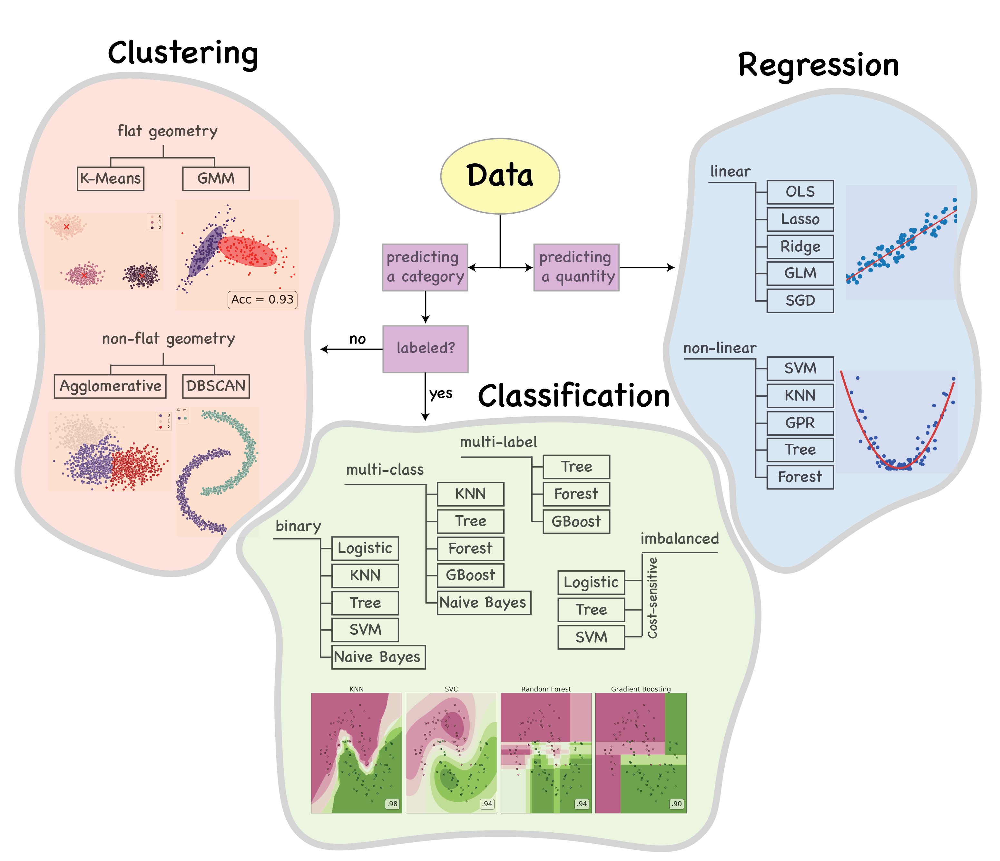

# Machine Learning

## How to choose the right algorithm?

**Machine learning** is the subset of artificial intelligence that involves the study and use of algorithms and statistical models for computer systems to perform specific tasks without human interaction. Machine learning models rely on patterns and inference instead of manual human instruction. Most any task that can be completed with a data-defined pattern or set of rules can be done with machine learning. This allows companies to automate processes that were previously only possible for humans to perform.

Machine learning is typically used for projects that involve predicting an output or uncovering trends. In these examples, a limited body of data is used to help the machines learn patterns that they can later use to make a correct determination on new input data. Common algorithms used in machine learning are Logistic regression, K-means clustering, Random forest, and many more.

But how do we choose the right machine learning algorithm? 

*The answer to this question depends on the nature of our data and whether we want to predict a quantity or a quality, and if quality, is our data labeled or not?*

In the past when I decided to establish my career as a Data scientist, I was quite lost and had difficulty to choose the best model, and now I see **there is no best model**. 

Below I have designed a simple flowchart which can guide you on choosing the machine learning algorithm which is suitable for your dataset and purpose.

If you need more details, please find above a scikit-learn cheat sheet, plus most popular Regression, Classification, and Clustering models with detailed and conceptual explanations; at the end of each script I have also explained different model performance metrics. 

